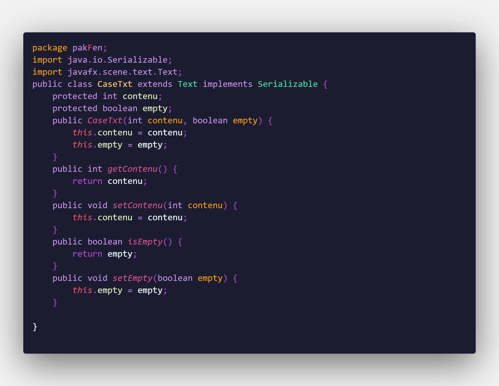
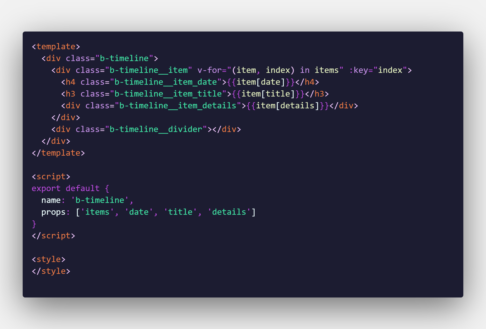
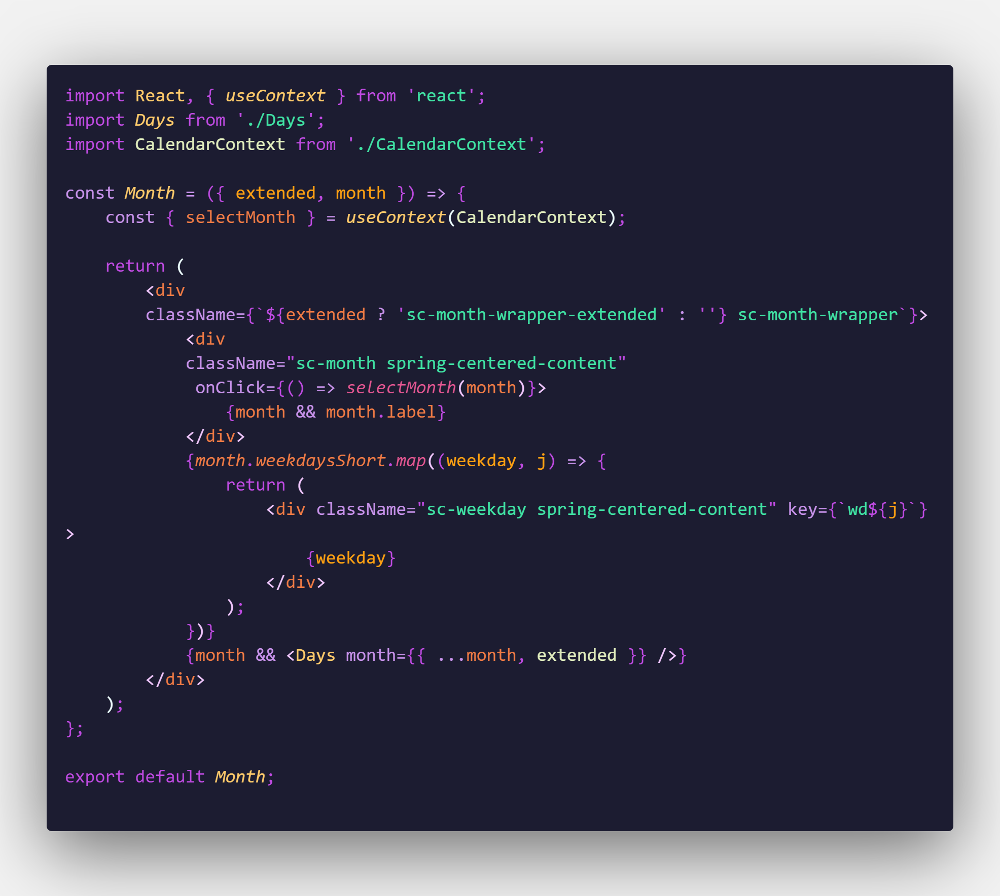
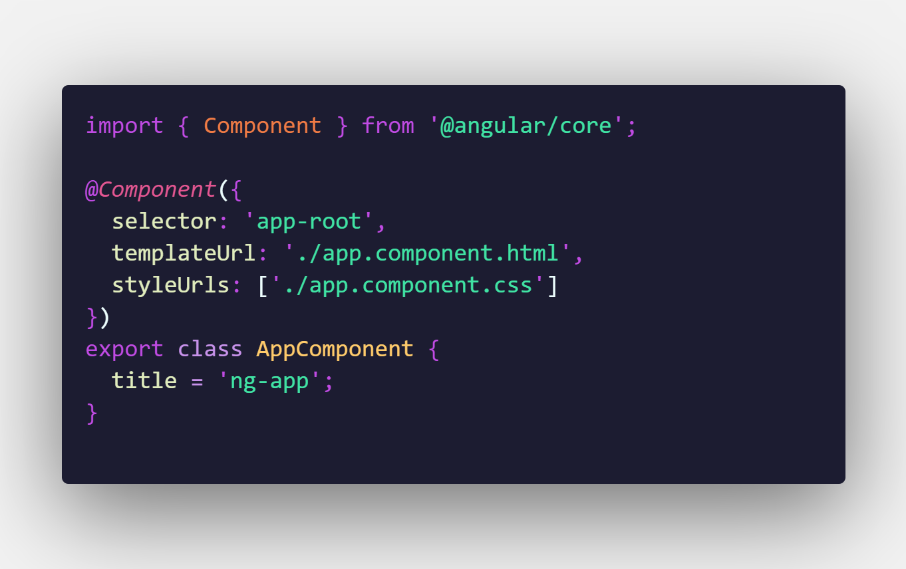
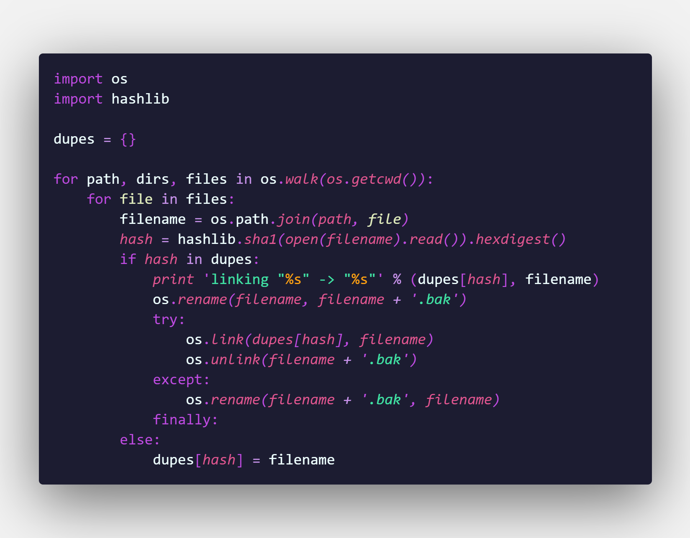

# Nocture birds

A Visual Studio Code theme with elegant colors based on good contrast.

# Installation 

 1. Launch Visual Studio Code
 2. Select Extensions from left toolbar
 3. Search for `Nocture birds`
 4. Install it
 5. Press `Ctrl+K Ctrl+T` or  ***Code > Preferences > Color Theme*** to show themes dropdown then choose `Nocture birds`

 # Previews
 ## Java
 

 ## Vue
 

 ## React
 

 ## Angular
 

 ## Python
 